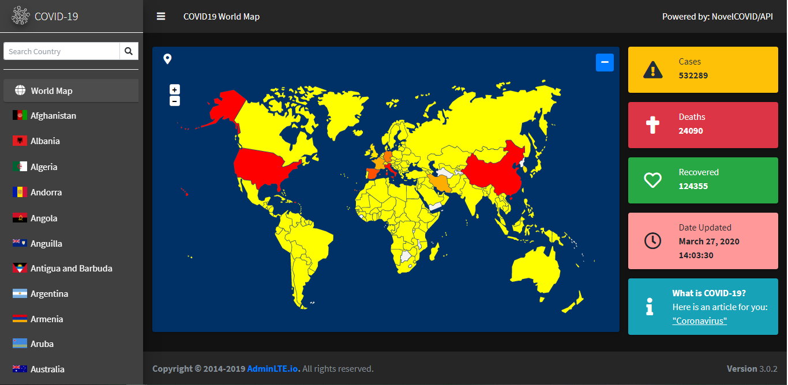

# COVID-19 Monitoring WebApp

A online monitoring tool for the numbers of cases related to COVID-19 using the NovelCOVID/API data.

## Screenshots

## This is currently online

This web app is currently viewable in [aldrickb.com/covid-19-monitoring/](https://aldrickb.com/covid-19-monitoring/)

## Built With

* [NovelCOVID/API](https://github.com/NovelCOVID/API) - The data used
* [ColorlibHQ/AdminLTE](https://adminlte.io) - The template used